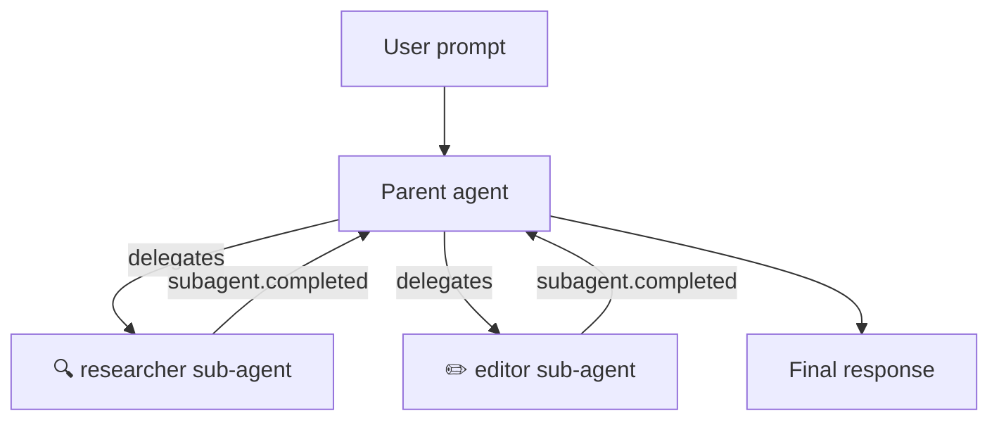

# Custom Agents & Sub-Agent Orchestration

Define specialized agents with scoped tools and prompts, then let Copilot orchestrate them as sub-agents within a single session.

## Overview

Custom agents are lightweight agent definitions attached to a session. Each agent has its own system prompt, tool restrictions, and optional MCP servers. When a user's request matches an agent's expertise, the Copilot runtime automatically delegates to that agent as a **sub-agent** — running it in an isolated context while streaming lifecycle events back to the parent session.



| Concept | Description |
|---------|-------------|
| **Custom agent** | A named agent config with its own prompt and tool set |
| **Sub-agent** | A custom agent invoked by the runtime to handle part of a task |
| **Inference** | The runtime's ability to auto-select an agent based on the user's intent |
| **Parent session** | The session that spawned the sub-agent; receives all lifecycle events |

## Defining Custom Agents

Pass `:custom-agents` when creating a session. Each agent requires at minimum `:agent-name` and `:agent-prompt`:

```clojure
(require '[github.copilot-sdk.client :as copilot])

(def client (copilot/client))
(copilot/start! client)

(def session
  (copilot/create-session client
    {:model "gpt-5.2"
     :on-permission-request copilot/approve-all
     :custom-agents
     [{:agent-name "researcher"
       :agent-display-name "Research Agent"
       :agent-description "Explores codebases and answers questions using read-only tools"
       :agent-tools ["grep" "glob" "view"]
       :agent-prompt "You are a research assistant. Analyze code and answer questions. Do not modify any files."}
      {:agent-name "editor"
       :agent-display-name "Editor Agent"
       :agent-description "Makes targeted code changes"
       :agent-tools ["view" "edit" "bash"]
       :agent-prompt "You are a code editor. Make minimal, surgical changes to files as requested."}]}))
```

The helpers API also accepts `:custom-agents` via session options:

```clojure
(require '[github.copilot-sdk.helpers :as h])

(h/query "Refactor the auth module"
  :session {:on-permission-request copilot/approve-all
            :model "gpt-5.2"
            :custom-agents
            [{:agent-name "researcher"
              :agent-prompt "You explore and analyze code. Never suggest modifications directly."
              :agent-tools ["grep" "glob" "view"]}
             {:agent-name "implementer"
              :agent-prompt "You make precise code changes as instructed."
              :agent-tools ["view" "edit" "bash"]}]})
```

## Configuration Reference

| Key | Type | Required | Description |
|-----|------|----------|-------------|
| `:agent-name` | string | ✅ | Unique identifier for the agent |
| `:agent-display-name` | string | | Human-readable name shown in events |
| `:agent-description` | string | | What the agent does — helps the runtime select it |
| `:agent-tools` | vector or `nil` | | Tool names the agent can use. `nil` or omitted = all tools |
| `:agent-prompt` | string | ✅ | System prompt for the agent |
| `:mcp-servers` | map | | MCP server configurations specific to this agent |
| `:agent-infer?` | boolean | | Whether the runtime can auto-select this agent (default: `true`) |

> **Tip:** A good `:agent-description` helps the runtime match user intent to the right agent. Be specific about the agent's expertise and capabilities.

## How Sub-Agent Delegation Works

When you send a prompt to a session with custom agents, the runtime evaluates whether to delegate to a sub-agent:

1. **Intent matching** — The runtime analyzes the user's prompt against each agent's `:agent-name` and `:agent-description`
2. **Agent selection** — If a match is found and `:agent-infer?` is not `false`, the runtime selects the agent
3. **Isolated execution** — The sub-agent runs with its own prompt and restricted tool set
4. **Event streaming** — Lifecycle events (`:copilot/subagent.started`, `:copilot/subagent.completed`, etc.) stream back to the parent session
5. **Result integration** — The sub-agent's output is incorporated into the parent agent's response

### Controlling Inference

All custom agents are available for automatic selection by default. Set `:agent-infer?` to `false` to prevent the runtime from auto-selecting an agent — useful for agents you only want invoked through explicit user requests:

```clojure
{:agent-name "dangerous-cleanup"
 :agent-description "Deletes unused files and dead code"
 :agent-tools ["bash" "edit" "view"]
 :agent-prompt "You clean up codebases by removing dead code and unused files."
 :agent-infer? false}
```

## Sub-Agent Lifecycle Events

When a sub-agent runs, the parent session emits lifecycle events. Subscribe with `on-event` to build UIs that visualize agent activity.

### Event Types

| Event | Emitted when | Data |
|-------|-------------|------|
| `:copilot/subagent.selected` | Runtime selects an agent for the task | `agentName`, `agentDisplayName`, `tools` |
| `:copilot/subagent.started` | Sub-agent begins execution | `toolCallId`, `agentName`, `agentDisplayName`, `agentDescription` |
| `:copilot/subagent.completed` | Sub-agent finishes successfully | `toolCallId`, `agentName`, `agentDisplayName` |
| `:copilot/subagent.failed` | Sub-agent encounters an error | `toolCallId`, `agentName`, `agentDisplayName`, `error` |
| `:copilot/subagent.deselected` | Runtime switches away from the sub-agent | — |

### Subscribing to Events

```clojure
(require '[github.copilot-sdk.client :as copilot]
         '[github.copilot-sdk.session :as session])

(def unsubscribe
  (session/on-event session
    (fn [event]
      (case (:type event)
        :copilot/subagent.started
        (let [{:keys [agent-display-name agent-description tool-call-id]} (:data event)]
          (println (str "▶ Sub-agent started: " agent-display-name))
          (println (str "  Description: " agent-description))
          (println (str "  Tool call ID: " tool-call-id)))

        :copilot/subagent.completed
        (println (str "✅ Sub-agent completed: " (get-in event [:data :agent-display-name])))

        :copilot/subagent.failed
        (let [{:keys [agent-display-name error]} (:data event)]
          (println (str "❌ Sub-agent failed: " agent-display-name))
          (println (str "  Error: " error)))

        :copilot/subagent.selected
        (let [{:keys [agent-display-name tools]} (:data event)]
          (println (str "🎯 Agent selected: " agent-display-name))
          (println (str "  Tools: " (or tools "all"))))

        :copilot/subagent.deselected
        (println "↩ Agent deselected, returning to parent")

        nil))))

(session/send-and-wait! session
  {:prompt "Research how authentication works in this codebase"})
```

### Building an Agent Activity Tracker

Sub-agent events include `tool-call-id` fields that let you reconstruct the execution tree:

```clojure
(def agent-tree (atom {}))

(session/on-event session
  (fn [event]
    (case (:type event)
      :copilot/subagent.started
      (let [{:keys [tool-call-id agent-name agent-display-name]} (:data event)]
        (swap! agent-tree assoc tool-call-id
               {:name agent-name
                :display-name agent-display-name
                :status :running
                :started-at (System/currentTimeMillis)}))

      :copilot/subagent.completed
      (let [id (get-in event [:data :tool-call-id])]
        (swap! agent-tree update id merge
               {:status :completed
                :completed-at (System/currentTimeMillis)}))

      :copilot/subagent.failed
      (let [{:keys [tool-call-id error]} (:data event)]
        (swap! agent-tree update tool-call-id merge
               {:status :failed
                :error error
                :completed-at (System/currentTimeMillis)}))

      nil)))
```

## Scoping Tools per Agent

Use `:agent-tools` to restrict which tools an agent can access. This enforces the principle of least privilege and keeps agents focused:

```clojure
(def session
  (copilot/create-session client
    {:model "gpt-5.2"
     :on-permission-request copilot/approve-all
     :custom-agents
     [{:agent-name "reader"
       :agent-description "Read-only exploration of the codebase"
       :agent-tools ["grep" "glob" "view"]
       :agent-prompt "You explore and analyze code. Never suggest modifications directly."}
      {:agent-name "writer"
       :agent-description "Makes code changes"
       :agent-tools ["view" "edit" "bash"]
       :agent-prompt "You make precise code changes as instructed."}
      {:agent-name "unrestricted"
       :agent-description "Full access agent for complex tasks"
       :agent-tools nil
       :agent-prompt "You handle complex multi-step tasks using any available tools."}]}))
```

When `:agent-tools` is `nil` or omitted, the agent inherits access to all tools configured on the session. Use explicit tool vectors to restrict access.

## Attaching MCP Servers to Agents

Each custom agent can have its own MCP (Model Context Protocol) servers, giving it access to specialized data sources:

```clojure
(def session
  (copilot/create-session client
    {:model "gpt-5.2"
     :on-permission-request copilot/approve-all
     :custom-agents
     [{:agent-name "db-analyst"
       :agent-description "Analyzes database schemas and queries"
       :agent-prompt "You are a database expert. Use the database MCP server to analyze schemas."
       :mcp-servers
       {"database"
        {:mcp-command "npx"
         :mcp-args ["-y" "@modelcontextprotocol/server-postgres" "postgresql://localhost/mydb"]}}}]}))
```

See the [MCP Servers guide](../mcp/overview.md) for details on MCP server configuration.

## Patterns & Best Practices

### Pair a researcher with an editor

A common pattern is to define a read-only researcher agent and a write-capable editor agent. The runtime delegates exploration tasks to the researcher and modification tasks to the editor:

```clojure
(def session
  (copilot/create-session client
    {:model "gpt-5.2"
     :on-permission-request copilot/approve-all
     :custom-agents
     [{:agent-name "researcher"
       :agent-description "Analyzes code structure, finds patterns, and answers questions"
       :agent-tools ["grep" "glob" "view"]
       :agent-prompt "You are a code analyst. Thoroughly explore the codebase to answer questions."}
      {:agent-name "implementer"
       :agent-description "Implements code changes based on analysis"
       :agent-tools ["view" "edit" "bash"]
       :agent-prompt "You make minimal, targeted code changes. Always verify changes compile."}]}))
```

### Keep agent descriptions specific

The runtime uses `:agent-description` to match user intent. Vague descriptions lead to poor delegation:

```clojure
;; ❌ Too vague — runtime cannot distinguish from other agents
{:agent-description "Helps with code"}

;; ✅ Specific — runtime knows when to delegate
{:agent-description "Analyzes Python test coverage and identifies untested code paths"}
```

### Handle failures gracefully

Sub-agents can fail. Listen for `:copilot/subagent.failed` events and handle them in your application:

```clojure
(session/on-event session
  (fn [event]
    (when (= :copilot/subagent.failed (:type event))
      (let [{:keys [agent-name error]} (:data event)]
        (println (str "Agent " agent-name " failed: " error))))))
```

### Multi-agent orchestration with core.async

For parallel workflows spanning multiple sessions, see the [multi-agent example](../../examples/multi_agent.clj) which demonstrates a pipeline of researchers running concurrently via `go` blocks, followed by sequential analysis and synthesis phases.

## See Also

- [API Reference — Session Configuration](../reference/API.md#session-configuration) — all session config keys
- [API Reference — Event Types](../reference/API.md#event-types) — complete event type list
- [MCP Servers](../mcp/overview.md) — MCP server configuration
- [Multi-Agent Example](../../examples/multi_agent.clj) — working multi-agent orchestration code
